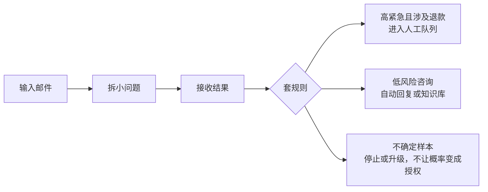
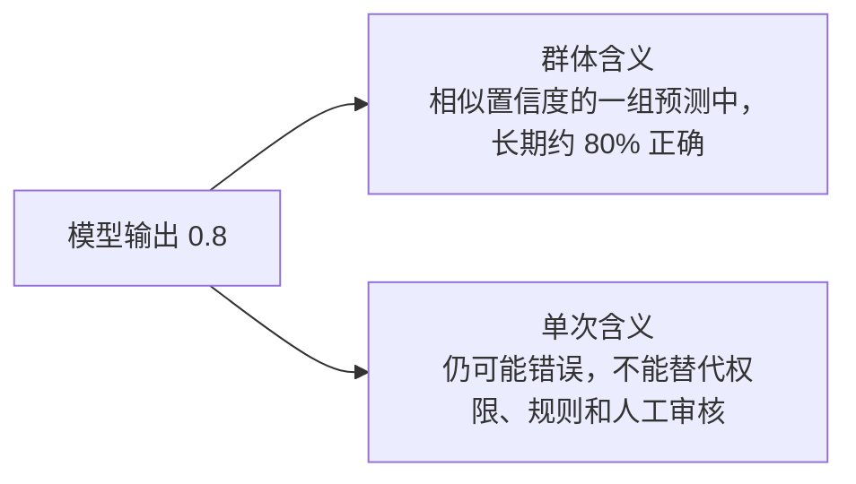
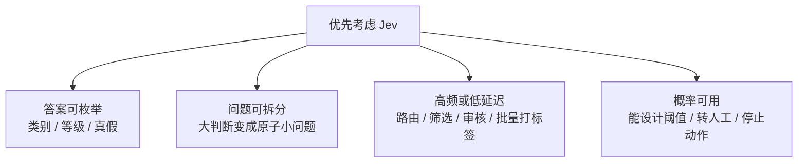

> 研究对象：TypeSafe AI 发布的 **Jev / System One model**。
> 范围覆盖官网、文档、博客、X、微信公众号、英文技术媒体、厂商工程博客与开源社区讨论。
{: .prompt-info }

## 入门导读

> **60 秒版本：** 你给它一段材料，再给它几个预设问题，它返回很短、固定、可被程序直接使用的结果。

Jev 是 TypeSafe AI 推出的模型，但它不是“另一个 ChatGPT”。它更像给程序装上的一个判断模块：你给它一段材料，再给它几个预设问题，它返回很短、固定、可被程序直接使用的结果。它做的不是“写一段话”，而是“选一个答案、打一个分、判断真假”。

如果把普通 LLM 理解成“会写作的通才”，Jev 更像“流水线上的质检工位”。它不负责聊天，也不负责长篇解释，只负责在明确规则下给出明确判断。

### 一个具体例子

输入是一封客服邮件，Jev 面对的问题可以是：

- 这封邮件属于售前、售后、投诉还是其他？
- 紧急程度是 1 到 5 分里的几分？
- 是否需要人工跟进？

输出不是长文，而是类似 `{type:"售后", urgency:4, needs_human:true}` 的结构化结果。程序可以直接根据这个结果分流、报警或转给人工。

### 普通 LLM 和 Jev 的差别

| 维度 | 普通 LLM | Jev |
|---|---|---|
| 主要任务 | 生成文本、聊天、总结、写作 | 做选择题、打分题、判断题 |
| 输出形态 | 自然语言，长短不定 | 固定结构，体量很小 |
| 典型优势 | 表达力强、通用性好 | 快、便宜、易接入程序 |
| 弱项 | 高频小判断慢且贵 | 开放写作、长解释、多步推理 |

### 建立基本认识

把 Jev 理解成 Agent 系统里的“前置判断层”。很多 Agent 每一步都要问：该走哪个分支？这条信息相关吗？要不要交给人工？如果每次都用大模型，成本和延迟都会变高。Jev 的价值是把这些低层判断抽出来，让通用模型只在需要表达、推理或写作时才出场。

> **读链接前先记住三句话：** Jev 不是聊天机器人；它的输出更像表单而不是作文；zero hallucination 指输出形状受 schema 约束，不等于判断永远正确。

## 核心结论

Jev 不是一个通用聊天模型，而是 TypeSafe AI 定义的 **System One model**：面向机器和软件调用的结构化决策模型。它不生成自然语言答案，而是在预设输入状态下，对一组问题返回可被程序直接消费的结构化结果。

官方核心卖点是：快、便宜、输出严格受限、适合作为 Agent 系统中的判断层。它适合高频分类、路由、筛选、策略检查、验证和轻量编排；不适合开放式写作、多轮对话、复杂推理和需要解释理由的场景。

> **一句话判断：** 它适合做 Agent 系统里的高频分类、路由、筛选、评分和验证层，不适合替代通用 LLM 做开放式生成、复杂推理或需要解释的场景。

对宣传口径要保持两点区分。第一，所谓 **zero hallucination** 主要指输出不会越过预设 schema，不等于判断一定正确，Jev 仍可能选错选项或给出错误概率。第二，官方和部分厂商文章中的大幅提速、降本数据多来自自建评测，缺少权威独立大规模复现；第三方实测方向总体有利，但样本普遍较小。

## 工作原理与使用方法

### 怎么做：一次调用的实际形状

1. **准备 state：** 把客服邮件、工单、检索结果、JSON 数据或文本数组放进输入。
2. **预设问题：** 不要问“帮我分析这封邮件”，而是拆成类别、紧急度、是否需要人工跟进等小问题。
3. **预设答案空间：** 类别只能是固定枚举，分数只能是固定等级，真假判断只输出 0 到 1 的概率。
4. **批量提交：** 同一 state 上的独立问题可以并行评估。
5. **接收 typed decision：** 程序拿到结构化结果和概率，而不是自然语言文本。
6. **代码执行后续：** 分支、副作用、权限、规则、加权求和和阈值处理都留在软件里。

这个设计把“语义判断”和“行动执行”分开。Jev 只负责前者，后者必须由可审计、可测试的代码控制。官方文档反复强调这一点，硅鱼之乐的实测也说明：如果 Agent 把概率当成授权，风险会直接进入系统。

### 为什么这么做

传统 LLM 做 API 决策时，常见问题不是“不能答”，而是“答得太贵、太慢、太松”。为了让模型输出 JSON，需要约束解码、schema 校验、重试和解析；如果任务只是 20 个二值判断，用大模型生成文本再解析，成本和延迟都不划算。

Jev 的取舍是提前收窄答案空间。分类任务的答案本来就只有几个枚举值，评分任务本来就是几个等级，布尔任务本来就是真假；模型可以直接在这些受限空间上输出概率，而不必自回归地生成一段话。这样换来的是更低延迟、更低输入成本、更稳定的输出类型、可并行的小问题和可直接阈值化的概率。

训练目标是 **RLCD**（Reinforcement Learning for Calibrated Decisions）：优化决策和校准概率，而不是优化聊天文本。校准指模型长期说 0.8 时，相似置信度的一组预测大约应有八成正确；但校准不能保证某一次 0.8 的预测一定对。

> **RLHF / RLVR / RLCD：** RLHF 面向人类偏好和对话有用性；RLVR 面向可验证奖励和推理任务；RLCD 面向可组合进程序的决策和可用不确定性。

### 和 LLM 的区别

| 问题 | 普通 LLM | Jev |
|---|---|---|
| 解决什么 | 生成、总结、解释、对话、复杂推理 | 在预设答案空间里做选择、评分和真假判断 |
| 输出 | 逐 token 生成的自然语言 | typed decision 和概率 |
| 接口形态 | 面向人或下游文本处理 | 面向软件直接消费 |
| 不确定性 | 常需从文本、logprob 或采样频率间接推断 | 概率是核心输出，可做阈值和校准 |
| 控制流 | 容易被提示词和生成内容带偏 | 分支、规则和副作用留在代码 |
| 换来什么 | 表达弹性和通用性 | 低延迟、低输入成本、类型稳定、并行小判断 |
| 付出什么 | 高频小任务可能贵且慢 | 开放生成和长解释能力弱，内部结构不透明 |

Jev 不是“更小的 ChatGPT”，而是另一种接口形态：把 LLM 的表达自由度换成决策效率和可组合性。更合理的架构通常是 Jev 前置做路由、筛选和验证，LLM 后置做理解、推理、写作和多轮交互。

### 为什么要用

当任务满足四个条件时，Jev 值得优先试验：答案空间可以预先枚举；判断能拆成小问题；调用频率高或延迟敏感；概率可以转化为阈值决策。典型例子包括模型路由、客服工单分类、内容风险分级、检索相关性判断、Agent 是否调用昂贵工具、批量数据打标签。

如果任务需要开放式写作、长链推理、自然语言理由、图像音频视频输入、本地私有化部署或强中文同等可靠性，Jev 不是首选。概率也不能替代权限系统：高置信删除数据库不等于允许删除。

### 怎么用：入门路径

1. **找真实小任务：** 从 50 到 200 条业务样本开始，不要直接测试“智能”。
2. **定义标准答案：** 没有 ground truth，就没有准确率、校准和召回可谈。
3. **拆问题：** 把“这封邮件严重吗”拆成类别、情绪、退款请求、账号异常、是否需人工等原子判断。
4. **精简 state：** 只放判断需要的上下文，避免塞入大段无关对话。
5. **设计阈值：** 低风险任务自动处理，中置信转人工，低置信或高损失场景停止或升级。
6. **对比基线：** 与现有 LLM、规则系统和小模型比较准确率、校准误差、延迟、成本和失败模式。
7. **再上生产：** 先影子运行或灰度，确认校准稳定、边界清晰后再接自动动作。

## 官方资料

| 资料 | 入口 | 价值 |
|---|---|---|
| 官网 | [打开](https://typesafe.ai/) | 快速确认产品定位和发布入口。 |
| Manifesto | [打开](https://typesafe.ai/manifesto) | 理解“机器优先模型”的公司叙事。 |
| Team | [打开](https://typesafe.ai/team) | 确认团队背景。 |
| 官方发布文 | [打开](https://typesafe.ai/blog/introducing-system-one-models-and-jev) | 最核心的一手介绍，包含发布背景与设计思路。 |
| Introduction | [打开](https://docs.typesafe.ai/introduction) | API 与基础概念入口。 |
| Quickstart | [打开](https://docs.typesafe.ai/introduction/quickstart) | 从接口调用开始入门。 |
| System One | [打开](https://docs.typesafe.ai/concepts/system-one) | 解释 System One 与普通 LLM 的边界。 |
| Machine Learning Primer | [打开](https://docs.typesafe.ai/introduction/machine-learning-primer) | 解释模型类型、RLCD、校准和不确定性的官方基础课。 |
| 构建 System One 应用 | [打开](https://docs.typesafe.ai/concepts/how-to-build-with-system-one) | 官方系统设计建议，说明控制流、上下文和问题拆分。 |
| Confidence | [打开](https://docs.typesafe.ai/confidence) | 解释概率如何使用、校准和阈值决策。 |
| Primitives | [打开](https://docs.typesafe.ai/primitives) | 定义 `Choice`、`Score`、`Noul` 三个原语，必读。 |
| Models | [打开](https://docs.typesafe.ai/models) | 模型版本、别名与能力限制。 |
| Evals | [打开](https://evals.typesafe.ai/) | 官方评测入口，注意属于厂商自建口径。 |
| GitHub | [打开](https://github.com/typesafe-ai) | SDK、示例与生态项目入口。 |

## 技术速览

| 维度 | 内容 |
|---|---|
| 发布时间 | 2026-09-15 |
| 公司 | TypeSafe AI；$40M seed，DCVC 领投 |
| 核心团队 | Diogo Almeida（CEO，前 Google Brain / OpenAI）、Sasha Sheng（COO，前 Meta / FAIR）、Erik Gafni（CTO，连续创业者） |
| 模型版本 | `jev-1.13.0`，别名 `jev-latest`、`jev-preview` |
| 上下文 | 64k tokens；同一 state 加最长问题约 32k |
| 输入 | 文本、JSON、文本数组；不支持图片、音频、视频 |
| 价格 | 输入 $0.042 / 1M tokens；输出免费 |
| 延迟 | 官方称约 70-500ms |
| 训练 | RLCD，强化学习面向校准决策 |
| 架构 | 并行采样，不是自回归文本生成 |
| 语言 | 英语最强，中文可用但不保证同等可靠性 |
| 定制 | 不支持客户数据微调或 LoRA |

### 三个原语

| 原语 | 含义 | 适用场景 |
|---|---|---|
| `Choice` | 从预设选项中选择，最多 255 个选项 | 分类、路由、枚举决策 |
| `Score` | 按预定义等级评分 | 质量评估、风险分级、内容审核 |
| `Noul` | 输出 0 到 1 的真假概率 | 布尔判断、阈值筛选、低置信样本召回 |
| 并行问题 | 同一 state 上的多个独立问题可并行评估 | 批量判断、管道前置筛选 |

## 论文与独立证据

> **先分清证据类型：** TypeSafe AI 尚未发布正式架构论文或完整技术报告；模型内部结构、训练数据、参数量、损失细节和复现条件均未充分披露。第一手材料仍是官方博客与文档，尤其是 Machine Learning Primer、System One、构建指南、Confidence 和 Primitives。

目前已出现的 arXiv 论文是第三方评测和应用研究，不是 Jev 的核心架构论文。它们的价值在于验证“结构化决策接口在某些任务里是否可用”，而不是揭示 Jev 内部到底怎么做。

| 论文 | 链接 | 核心结论与边界 |
|---|---|---|
| Jev for Scientific Decisions | [打开](https://arxiv.org/abs/2609.24965) | 把 Jev 当作语义决策组件，算术和确定性计算留在代码。20 个 source-grounded Choices、10 个科学案例、5 次重复，共比较 12 个配置。Jev 在完整语义正确率上追平另外五个配置，并在成功响应中取得最低中位延迟。该论文强调要评估下游后果，而不是只看单次选择是否顺眼。 |
| Calibrated Decisions at Scale | [打开](https://arxiv.org/abs/2609.24052) | 将警察事故叙述转换为 27 个问题的概率化变量，先筛选 499,500 条 Texas 叙述，再编码 195,857 条。对照盲评人工标签，Jev F1 为 0.908；一个前沿 LLM 提升 0.059，另一个统计上不可区分。校准随模型变化，重校准将校准误差降低 3.3 倍。这是目前最有说服力的大规模结构化数据编码案例，但仍属于特定领域结果。 |
| JEVQA | [打开](https://arxiv.org/abs/2609.24395) | 评估 Jev 的零样本视频质量决策。1,936 个编码中，metadata-only JEVQA 的 Pearson 相关为 0.737，接近标准化 ITU-T P.1204.1 的 0.733；bitstream 特征提升到 0.797，pixel 与 bitstream 结合达到 0.824。同特征训练模型仍领先。需要注意的是，Jev 输入的是文本化或结构化特征，不是原始视频多模态输入。 |

> **论文共同指向：** Jev 适合处理可枚举的语义判断，并把计算、规则、权限和后果评估留在代码里；上线前必须审计校准，必要时重校准。

## 英文第三方分析

| 来源 | 入口 | 关键判断 |
|---|---|---|
| InfoWorld | [打开](https://www.infoworld.com/article/4223468/typesafe-ais-new-models-work-with-machines-not-humans.html) | 适合与通用 LLM 组合，用于路由、评分、验证、策略检查和 workflow orchestration；企业需自行验证准确率与校准。 |
| MarkTechPost | [打开](https://www.marktechpost.com/2026/09/19/typesafe-ai-releases-jev/) | transformer-based 但不是传统 LLM；未公开权重、参数量和自托管；benchmark 主要是厂商自建。 |
| TrueFoundry | [打开](https://www.truefoundry.com/blog/typesafe-ai-jev) | 工程价值明显，但 193.6x 速度和 444.6x 成本来自自建评测，不能直接外推。 |
| LangChain | [打开](https://www.langchain.com/blog/building-a-harness-with-jev) | 展示具体 harness 用法，工程参考价值高。 |
| LangSmith eval | [打开](https://www.langchain.com/blog/jev-agent-evals-langsmith) | 5 条固定轨迹、每条重复 100 次；Jev 500/500 与人工标准一致，平均约 0.44s，总成本 $0.34，Claude 对照 $28.17。任务面窄，需限制解读范围。 |
| MindStudio | [打开](https://www.mindstudio.ai/blog/jev-use-cases-automation) | 12 个自动化用例显示适合高频分类、路由和实时筛选；推荐 Jev 前置筛选 + 通用模型后续处理。 |
| MindStudio 概念 | [打开](https://www.mindstudio.ai/blog/jev-system-one-model) | 更偏 System One 概念解释，强调非自回归架构。 |
| Vercel | [打开](https://vercel.com/ai-gateway/models/jev) | 模型接入页，可确认调用入口和基础信息。 |

> **MindStudio 成本示例：** 1000 封邮件约 9 美分；1000 条 YouTube 评论约 5 美分；近 2 万次请求总成本低于 1 美元。这些数据来自特定用例，需结合自己的输入长度和调用频率复测。

## X 与社区讨论

| 来源 | 入口 | 观察 |
|---|---|---|
| TypeSafe AI | [打开](https://x.com/typesafeai) | 官方发布、演示、版本更新与生态互动。 |
| CompleteSkeptic | [打开](https://x.com/CompleteSkeptic/status/2099925682726002904) | 代表技术圈对 Jev 概念的早期讨论。 |
| TypeSafe AI | [打开](https://x.com/typesafeai/status/2099944756931596454) | 官方补充说明或演示内容。 |
| TypeSafe AI | [打开](https://x.com/typesafeai/status/2101786156572823624) | 后续发布与生态更新。 |
| TypeSafe AI | [打开](https://x.com/typesafeai/status/2101490102866493522) | 后续发布与生态更新。 |
| Guillermo Rauch | [打开](https://x.com/rauchg/status/2100307962262872105) | 称 Jev 在 p95 上快 18 倍且更准确，但 reviewer 仍跑 GPT Luna。 |

Reddit 实测代表：[模型路由对比](https://www.reddit.com/r/AI_Agents/comments/1wl82fr/tried_typesafe_ais_jev_vs_a_regular_llm_for_model/)。用户实测 Jev 约 1 秒，普通 LLM 结构化输出约 4-14 秒；样本小，但方向与官方延迟主张一致。

MarkTechPost 整理的社区项目包括 `browser-use/jev-ultrafast`、`droidrun/mobile-jev`、`ChetasLua/jevmeter`、`phyous/tsai-sc`、`AbdelStark/heist-one`、`leepokai/jev-guard`、`realZachi/pg-jev`、`AboveColin/HA-Jev`。这些项目能说明生态热度，但不代表生产成熟度。

## 中文生态

| 来源 | 文章 | 价值 |
|---|---|---|
| 创业邦 / APPSO | [《刚刚，爆火模型 Jev 全面开放，所有用户送 1.2 亿 token》](https://www.36kr.com/p/3992394169613316) | 关注开放入口和 token 优惠，技术细节较少。 |
| 程序员小猿 / 编程 IT 圈 | [《全网爆火的 Jev 模型，为什么突然火了？》](<https://mp.weixin.qq.com/s?src=11&timestamp=1790046507&ver=6981&signature=n7N2j5l468GnShK1*BN5x1-cH1L58dh7M5aZacU-N1xTuktRWSG3dP8J7qoTK10uzdz*wyHHYLeNwnG7wc9tk-A*87OPoJJkZXj7GOCeXv8Kiub671miHOq-JfscW1je&new=1>) | 解释走红原因，适合入门。 |
| NFTDiamondhand | [《Jev 使用指南：一个不会聊天的 AI 模型，怎么用》](<https://mp.weixin.qq.com/s?src=11&timestamp=1790046551&ver=6981&signature=qGzQ9sVHNxkxd7nqk2V2y9jIhx809sFaXc4NmzHTQBu1Lz3qsTlxEjZ*3ps8FzPA-ZoOYOPhi9iQaEI8Jn4TUiGiQe5QWvoP4a9jgosckezJj8JH3oV9AUuKsk63hVy8&new=1>) | 帮助理解“不会聊天”的定位。 |
| 铁码 | [《Jev 模型真的是大模型革命吗? Jev 模型真的解决 AI 幻觉了吗？拆解营销号的概念偷换》](<https://mp.weixin.qq.com/s?src=11&timestamp=1790046573&ver=6981&signature=D5pusWYxuTee3tG7-0bh05I-nlmuARevuXU68ycaDqeZ7v3wglVSH1WVnxTwVJwkU6VPwPajpxcan8IBHmrGIMUqfzm8Fu0I2ZJnWOkG2Gpo5*nFJei-6aJG4-9XO6lq&new=1>) | 中文生态里批判价值最高，指出 schema 约束不等于判断正确。 |
| GoCN / ThinkInAI | [《Jev 和大语言模型：谁做什么？》](<https://mp.weixin.qq.com/s?src=11&timestamp=1790046357&ver=6981&signature=F*2llKYS1Dmtqcnj546e-SaMgMQMT2JnAkQUli1w8MoOZSTf04QhAixQnD56nJ-j7PCSGtKFUKdFs7dNQjS21em31xJ8hVUbJ5nOU4osTNKbYXcZhh8F4BhkekCiq1wO&new=1>) | 技术分工说明，并整理早期项目。 |
| 硅鱼之乐 | [《Jev：一个只做判断的模型，接进 Agent 的 16 场实测》](<https://mp.weixin.qq.com/s?src=11&timestamp=1790046856&ver=6981&signature=y*9muPtomkIfDm1qN9UaRD8TaKuKebqT9GFvNi5TpgikFf0-c4GV7Zr55MGQr-caiEZyhmPwbvy*M-p0kwe*MzX9CaLEDJu1coP0sDVaf*A9jUsMYTej50ZY2x7QqIRX&new=1>) | 实战参考价值高，暴露调用时机与权限边界问题。 |

> **硅鱼之乐实测：** 15 场常规对话中，Agent 应该调用 Jev 的 9 场里只调用了 7 场；不应该调用的 6 场里多调用了 3 场。难点不在单次 API，而在调用时机、上下文质量和权限边界。

公众号文章受微信平台访问限制，外链有时会临时失效；表中均为微信原文直达链接。

## 适用与不适用

| 分类 | 内容 |
|---|---|
| 适合 | 高频分类和路由、Agent 决策分支、内容审核与风险分级、低成本前置筛选、检索相关性判断、策略检查、批量布尔判断和评分、与通用 LLM 组成两级管道。 |
| 不适合 | 开放式对话和长文生成、需要自然语言解释的审计、复杂多步推理、多模态任务、需要本地部署或私有权重的合规场景、无法容忍中文性能差异的高可靠任务。 |

## 限制与风险

| 风险 | 说明 |
|---|---|
| 输出正确性 | schema 保证不等于语义正确。Jev 可以返回合法字段和取值，但仍可能选错或算错。 |
| 概率解释性 | `Noul` 返回概率但不解释原因。监管、金融、医疗等需要解释链路的场景不能单独依赖它。 |
| 第三方验证不足 | 官方 benchmark 强，但缺少权威独立复现；第三方实测样本和场景范围有限。 |
| 闭源与锁定 | 未公开权重、参数量和自托管方案，存在供应商锁定风险。 |
| 部署区域 | 当前为单区域托管，需要评估数据合规、延迟和可用性。 |
| 中文可靠性 | 英语最强，中文可用但不保证同等可靠性。中文业务应自建评测集。 |
| 定制能力 | 不支持客户数据微调或 LoRA，业务概念需要通过 state、问题和选项设计表达。 |

## 来源可信度

| 优先级 | 内容 |
|---|---|
| 高参考价值 | 官方文档、InfoWorld、MarkTechPost、LangChain 工程博客、TrueFoundry、MindStudio、硅鱼之乐实测。 |
| 中等参考价值 | X 时间线、Reddit 讨论、公众号入门文章、GitHub 社区项目。 |
| 需谨慎使用 | 官方 eval 中的大幅倍数、公众号传播中的“零幻觉”说法、未复现的厂商对比数据。 |
| 未纳入有效来源 | DataCamp 对应文章已核验为 404；The Register 页面有人机验证未能读全文；Hacker News Algolia 搜索未找到明确有效结果。 |

## 最终建议

Jev 的真实价值不在“取代大模型”，而在把 Agent 系统中大量低层级判断剥离出来，用更快、更便宜、更结构化的专用接口处理。对于分类、路由、筛选和验证密集型工作流，它值得试点；对于需要解释、复杂推理、多模态或强中文保证的场景，应保持谨慎。

> **试点方案：** 固定业务样本，定义明确 ground truth，比较 Jev 与现有模型的准确率、校准、延迟、成本和失败模式。只有这些指标同时满足要求，才放入生产路径。
